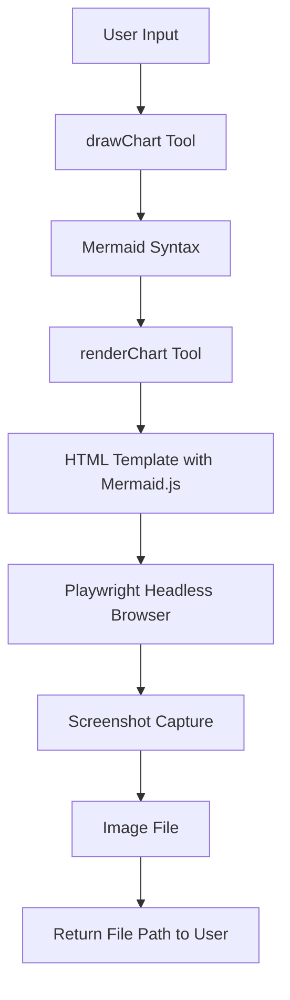

# Draw Agent PRD (Product Requirements Document)

## Overview

The Draw Agent is a specialized tool designed to create visualizations including charts, graphs, flow charts, and diagrams. This document outlines the requirements, specifications, and implementation plan for this visualization tool.

## Goals

- Create a flexible visualization tool that can analyze data and generate appropriate visualizations
- Support multiple visualization types (charts, graphs, diagrams, flow charts)
- Provide a simple interface for users to specify their visualization needs
- Generate high-quality visual outputs that communicate information effectively

## Requirements

### Functional Requirements

1. **Visualization Types**
   - Generate basic charts (bar charts, line charts, pie charts, scatter plots)
   - Create flow charts and process diagrams
   - Support entity relationship diagrams
   - Enable sequence diagrams for process flows
   - Support other specialized diagrams as needed (mindmaps, Gantt charts, etc.)

2. **Data Input**
   - Accept structured data in various formats (JSON, CSV-like strings, arrays)
   - Accept text descriptions for diagram generation
   - Intelligently determine the most appropriate visualization type based on data
   - Allow explicit specification of visualization type and parameters

3. **Output Format**
   - Output visualizations as Markdown with embedded diagram syntax
   - Ensure compatibility with common Markdown renderers
   - Optimize for readability in both rendered and source form
   - *Stretch Goal:* Support exporting visualizations as image files (PNG, JPEG) for standalone use

4. **Usability**
   - Provide clear error messages for malformed input
   - Include sensible defaults for styling and layout
   - Support customization of colors, labels, and other visual elements

### Technical Requirements

1. **Server-side Rendering**
   - Perform all visualization generation within Node.js
   - No dependency on browser rendering
   - Compatible with the MCP protocol for agent communication

2. **Performance**
   - Generate visualizations within reasonable time constraints
   - Optimize for memory usage during generation
   - Handle reasonably large datasets efficiently

3. **Maintainability**
   - Well-structured codebase with clear separation of concerns
   - Comprehensive documentation for all visualization types
   - Extensibility to add new visualization types in the future

## Implementation Strategy

### Visualization Libraries Research

After thorough research, we've evaluated several visualization libraries that could be used for our draw-agent. Here's a summary of our findings:

#### 1. Mermaid.js

**Overview:**
- JavaScript-based diagramming and charting tool that uses Markdown-inspired text definitions
- Renders various types of diagrams from text descriptions
- Widely adopted and integrated with many documentation systems
- Recently gained native support in GitHub Markdown

**Supported Diagram Types:**
- Flowcharts
- Sequence diagrams
- Class diagrams
- State diagrams
- Entity Relationship Diagrams
- User Journey Diagrams
- Gantt charts
- Pie charts
- Git graphs (Gitgraph)
- C4 diagrams
- Mindmaps
- Timeline diagrams
- and more

**Pros:**
- Text-based syntax is clean and readable even in source form
- No external dependencies for rendering in supported environments
- Extensive diagram type support
- Active development and community support
- Works well with Markdown, perfect for our agent's output format
- Server-side rendering possible via mermaid-cli (uses Puppeteer under the hood)

**Cons:**
- Some limitations in customization compared to full graphing libraries
- Server-side rendering requires Puppeteer which is heavyweight
- Not optimized for data-heavy visualizations like complex charts

**Server-side Compatibility:**
- Requires `@mermaid-js/mermaid-cli` for server-side rendering
- Can be called via Node.js API
- Outputs SVG or PNG formats

#### 2. Chart.js with server-side rendering

**Overview:**
- Popular JavaScript charting library 
- Flexible, clean design for statistical charts
- Can be rendered server-side using `chartjs-node-canvas` or similar libraries

**Supported Chart Types:**
- Line charts
- Bar charts
- Radar charts
- Pie/Doughnut charts
- Polar area charts
- Bubble charts
- Scatter charts

**Pros:**
- Excellent for data-driven statistical charts
- Beautiful, responsive design
- Extensive customization options
- Good performance with large datasets
- Well-documented API

**Cons:**
- Focused on charts rather than diagrams
- Requires additional setup for server-side rendering
- Not designed for flow charts or sequence diagrams

**Server-side Compatibility:**
- Works with `chartjs-node-canvas` for Node.js rendering
- Uses Canvas API for rendering
- Outputs PNG, JPEG or other raster formats

#### 3. D3.js (with server-side rendering solutions)

**Overview:**
- Extremely powerful, low-level visualization library
- Provides building blocks for custom visualizations
- The standard for advanced data visualization in web

**Supported Visualization Types:**
- Almost any visualization can be built with D3
- Common types: bar charts, line charts, area charts, networks, trees, maps
- Can be extended to create any custom visualization

**Pros:**
- Unmatched flexibility and customization
- Allows creation of virtually any visualization
- Precise control over every visual aspect
- Excellent for interactive visualizations

**Cons:**
- Very steep learning curve
- Requires significant code for basic visualizations
- More complex to implement server-side
- Overkill for simple chart generation

**Server-side Compatibility:**
- Can use `d3-node` for server-side rendering
- Works with Node.js Canvas implementations
- Requires more setup than other options

#### 4. Plotly.js

**Overview:**
- High-level charting library built on D3.js
- Focuses on scientific and statistical visualizations
- Good balance between flexibility and ease of use

**Supported Chart Types:**
- Statistical charts (bar, line, area, etc.)
- Scientific visualizations
- 3D charts
- Geographical maps
- Financial charts

**Pros:**
- Easier to use than D3.js while still powerful
- Good documentation and community support
- Built-in interactivity
- Scientific visualization features

**Cons:**
- Heavier than Chart.js
- Server-side rendering requires more configuration
- Not focused on diagram types like flowcharts

**Server-side Compatibility:**
- Requires headless browser approach with Puppeteer
- Some community solutions exist for server-side rendering
- Not as straightforward as Chart.js for server-side

#### 5. ECharts

**Overview:**
- Feature-rich charting and visualization library from Apache
- Supports a wide variety of chart types
- Popular especially in Asia

**Supported Chart Types:**
- Common charts (line, bar, scatter, pie, etc.)
- Candlestick charts for financial data
- Maps and geospatial visualizations
- Tree graphs and network diagrams
- Funnel and gauge charts

**Pros:**
- Highly customizable
- Good performance with large datasets
- Support for both Canvas and SVG rendering
- Extensive documentation

**Cons:**
- Heavier than some alternatives
- Server-side rendering requires additional setup
- API can be complex for simple use cases

**Server-side Compatibility:**
- Can be rendered server-side with headless browser approach
- Some community packages available but less mature
- Requires more custom code for integration

### Recommended Approach

Based on our research, we recommend using **Mermaid.js** as the primary visualization library for the Draw Agent, with the following reasons:

1. **Comprehensive Diagram Support**: Mermaid supports a wide range of diagram types including flowcharts, sequence diagrams, and others that align perfectly with our requirements.

2. **Text-Based Syntax**: Mermaid's text-based approach is ideal for our agent, as it can generate readable Markdown that works in many environments.

3. **Markdown Compatibility**: The output works seamlessly in Markdown, which aligns with our agent's response format.

4. **Server-Side Rendering**: While Mermaid typically runs in the browser, we can use `mermaid-cli` for server-side rendering when needed.

For data-heavy statistical visualizations where Mermaid may not be the best fit, we recommend complementing it with **Chart.js** using `chartjs-node-canvas` for server-side rendering:

1. **Data Visualization Expertise**: Chart.js excels at statistical charts and data visualization.

2. **Server-Side Rendering**: Well-supported server-side rendering via `chartjs-node-canvas`.

3. **Complementary Capabilities**: Together with Mermaid, this covers nearly all our visualization needs.

This combined approach provides the most comprehensive solution for our requirements while keeping implementation complexity manageable.

## Architecture

(To be expanded based on the selected libraries)

## Dependencies

Based on our research, we anticipate the following key dependencies:

1. **Primary Dependencies**
   - `mermaid` - Core Mermaid library
   - `@mermaid-js/mermaid-cli` - For server-side rendering of Mermaid diagrams
   - `chart.js` - For data-focused visualizations
   - `chartjs-node-canvas` - For server-side rendering of Chart.js
   - `canvas` - Node.js implementation of the HTML Canvas API

2. **Development Dependencies**
   - Standard TypeScript/JavaScript tooling
   - Testing libraries for verification of outputs

## Success Metrics

1. **Functionality**
   - Successful generation of all required visualization types
   - Accurate representation of provided data
   - Readable and well-formatted output

2. **Performance**
   - Acceptable rendering time for all visualization types
   - Reasonable memory usage during generation

3. **User Experience**
   - Clear and helpful error messages
   - Intuitive parameter specification
   - High-quality visual output

## Timeline and Milestones

1. **Phase 1: Core Implementation**
   - Set up basic library integration
   - Implement standard chart and diagram generation
   - Create basic error handling

2. **Phase 2: Advanced Features**
   - Add intelligent visualization type detection
   - Implement more complex diagram types
   - Enhance customization options

3. **Phase 3: Optimization and Testing**
   - Performance optimization
   - Comprehensive testing across visualization types
   - Documentation and examples

4. **Phase 4: Release and Maintenance**
   - Initial release
   - Monitoring and bug fixes
   - Feature enhancements based on feedback 

## Future Extensions

### Enhanced Visualization Rendering

Based on our experience and user feedback, we're enhancing the visualization capabilities to provide actual rendered visualizations rather than only text-based Mermaid syntax. This enhancement addresses the need for immediate visual feedback and aligns with our stretch goals.

## Visualization Tools

The Draw Agent will provide two complementary tools:

1. **drawChart Tool**
   - Primary function: Generate Mermaid syntax based on user data/requirements
   - Accepts data input and chart configuration
   - Returns Mermaid code that defines the visualization
   - Serves as the foundation for all visualization types

2. **renderChart Tool**
   - Primary function: Convert Mermaid syntax into visual image
   - Accepts Mermaid code (typically output from drawChart)
   - Uses Playwright in headless mode to render the visualization
   - Returns path to the generated image file
   - Provides options for image format and dimensions

## Implementation Strategy - Chart Rendering

For the rendering functionality, we will implement a Playwright-based approach:

1. **Rendering Process**:
   - Create an HTML template that includes the Mermaid.js library
   - Inject the Mermaid syntax into the template
   - Use Playwright in headless mode to load the HTML
   - Capture a screenshot of the rendered diagram
   - Save the screenshot to a temporary location
   - Return the path to the generated image

2. **Technical Implementation**:
   - Use Playwright for headless browser control and screenshots
   - Default screenshot resolution: 1920x1080
   - Support common image formats (PNG, JPEG)
   - Implement proper error handling for rendering failures
   - Enable custom sizing options as optional parameters

3. **HTML Template**:
   - Create a minimal HTML template that loads Mermaid.js from CDN
   - Include necessary initialization code as per Mermaid documentation
   - Design the template to properly size and position the diagram
   - Use CSS to ensure consistent rendering across different diagram types

## renderChart Tool Specification

The renderChart tool will have the following specification:

- **Name**: renderChart
- **Description**: Renders Mermaid diagram code as a visual image using Playwright
- **Input Parameters**:
  - `mermaidCode` (string, required): The Mermaid syntax to render
  - `width` (number, optional, default: 1920): Image width in pixels
  - `height` (number, optional, default: 1080): Image height in pixels
  - `format` (string, optional, default: "png"): Image format (png, jpeg)
  - `path` (string, optional): Custom save location, uses temp directory if not specified
  - `theme` (string, optional, default: "default"): Mermaid theme to use

- **Output**:
  - `imagePath` (string): Path to the generated image file
  - `success` (boolean): Whether the rendering was successful
  - `message` (string): Additional information or error message

## Rendering Process Flow

## Implementation Plan - Incremental Approach

To ensure stability and proper verification at each stage, we will implement the rendering functionality using the following step-by-step approach. Each step must be verified and approved by the product owner before proceeding to the next step.

### Phase 1: Foundation and Research

**Step 1.1: Environment Setup and Dependency Analysis**
- Review existing dependencies
- Add Playwright as a development dependency
- Verify package.json and build process still function correctly
- *Verification Point*: Package builds successfully with new dependencies

**Step 1.2: HTML Template Creation**
- Create a simple HTML template for Mermaid rendering
- Include Mermaid.js from CDN
- Implement basic initialization code
- *Verification Point*: Template can be manually verified by loading in a browser

**Step 1.3: Playwright Integration Test**
- Create a simple test script that uses Playwright
- Verify headless browser functionality
- Confirm screenshot capabilities
- *Verification Point*: Test script successfully captures a simple screenshot

### Phase 2: Basic Rendering Tool Implementation

**Step 2.1: Tool Definition**
- Define the renderChart tool interface in the codebase
- Add empty implementation that returns a success message
- Register the tool with the MCP server
- *Verification Point*: Tool appears in tools/list response

**Step 2.2: Basic HTML Rendering**
- Implement function to create HTML with Mermaid code
- Write the HTML to a temporary file
- *Verification Point*: Generated HTML contains correct Mermaid code

**Step 2.3: Basic Screenshot Capture**
- Implement Playwright initialization
- Add code to navigate to the HTML file
- Capture simple screenshot at default resolution
- *Verification Point*: Screenshots are generated and accessible

**Step 2.4: Tool Response Implementation**
- Implement proper response format for the tool
- Return file path to the generated image
- *Verification Point*: Tool returns valid path to generated image

### Phase 3: Enhanced Functionality

**Step 3.1: Parameter Implementation**
- Add support for width/height parameters
- Implement format parameter
- *Verification Point*: Parameters correctly affect the output

**Step 3.2: Error Handling**
- Add proper error handling for rendering issues
- Implement graceful fallbacks for common errors
- *Verification Point*: Errors are properly reported and don't crash the application

**Step 3.3: Theme Support**
- Implement theme parameter
- Add Mermaid theme initialization to the template
- *Verification Point*: Themes correctly apply to the generated chart

### Phase 4: Integration and Testing

**Step 4.1: Fix Image Size Issues**
- Modify the HTML template to ensure SVGs are properly sized
- Update the rendering logic to enforce minimum dimensions
- Ensure the viewport size properly constrains the diagram
- Add options to fit the diagram to the specified dimensions
- *Verification Point*: All diagrams render with proper dimensions regardless of content size

**Step 4.2: Improve Image Accessibility**
- Format the output as markdown with clickable links
- Copy images to a user-accessible location (e.g., ~/Downloads)
- Return output that includes clickable links to:
  - View the image directly in the browser
  - Download the image to the local system
- *Verification Point*: Users can easily view and download generated images

**Step 4.3: Enhanced Output Format**
- Update the tool's return type to specify markdown as the content format
- Include both file path and clickable links in the response
- Provide better formatted output with clear instructions for accessing the image
- *Verification Point*: Output is clear, user-friendly, and follows Markdown best practices

### Phase 5: Documentation and Refinement

**Step 5.1: User Documentation**
- Update README.md with new tool information
- Provide example usage patterns
- *Verification Point*: Documentation clearly explains the new functionality

**Step 5.2: Final Review**
- Comprehensive review of implementation
- Address any remaining issues or edge cases
- *Verification Point*: Product owner final approval

## Important Implementation Notes

1. **One Step at a Time**: Implement ONLY ONE step at a time, then verify functionality before proceeding to the next step.
2. **Verification Required**: Each step requires explicit verification and approval from the product owner.
3. **No Skipping Steps**: Steps must be completed in order to ensure stable progression.
4. **Testing**: Each step should include minimal tests to verify functionality.
5. **Rollback Plan**: If a step introduces issues, be prepared to roll back to the previous working state. 